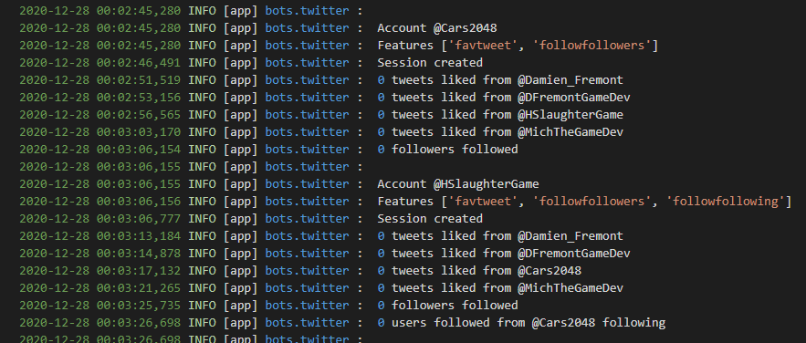

# TWITTER-BOT

[](https://twitter.com/Damien_Fremont)
[](https://opensource.org/licenses/MIT)


WORK IN PROGRESS !!!
================



---

The source code was adapted from this article: [How to Make a Twitter Bot in Python With Tweepy](https://realpython.com/twitter-bot-python-tweepy/)

---

## Requirements

### Install Python, pip

### Sign up for Twitter Developer Account

- Sign up for a separate account for your Twitter Bot and then apply for Twitter Developer Account following this link https://developer.twitter.com/en/apply-for-access 
- Enter the necessary details and await for your mail confirmation. Once confirmed, click on Create an App option.
- Enter the necessary details to generate the secret key and access tokens.
- Copy the keys and keep them safe.

---

## Getting Started

For all this we will need a Python library called Tweepy for accessing the Twitter API. We can install tweepy in three ways:

```bash
pip install -r requirements.txt --force-reinstall
```

---

## Usage (main)

```properties
# .\main.properties file

[Twitter]
twitter.TWITTER_ACCOUNTS = <YOUR ACCOUNT NAME>
twitter.TWITTER_FOLLOWFILE_MAX = 9
twitter.TWITTER_FAVUSERTWEET_MAX = 4

twitter.<YOUR_ACCOUNT>.TWITTER_CONSUMER_KEY = <...>
twitter.<YOUR_ACCOUNT>.TWITTER_CONSUMER_SECRET = <...>
twitter.<YOUR_ACCOUNT>.TWITTER_ACCESS_TOKEN = <...>
twitter.<YOUR_ACCOUNT>.TWITTER_ACCESS_TOKEN_SECRET = <...>

twitter.<YOUR_ACCOUNT>.TWITTER_FEATURES = followfollowers,retweetuser,tweetfile,followfriends,followfile
twitter.<YOUR_ACCOUNT>.TWITTER_FAVUSERTWEET_USERS = <ANOTHER ACCOUNT>,<ANOTHER ACCOUNT>
twitter.<YOUR_ACCOUNT>.TWITTER_FOLLOWFRIENDS_USERS = <ANOTHER ACCOUNT>
```

```bash
$ python .\src\main.py
```

you can add more features

```properties
# .\main.properties file

...
twitter.<YOUR_ACCOUNT>.TWITTER_FEATURES = favusertweet,followfollowers,retweetuser,tweetfile,followfriends,followfile
twitter.<YOUR_ACCOUNT>.TWITTER_FAVUSERTWEET_USERS = <ANOTHER ACCOUNT>,<ANOTHER ACCOUNT>
twitter.<YOUR_ACCOUNT>.TWITTER_FOLLOWFRIENDS_USERS = <ANOTHER ACCOUNT>
twitter.<YOUR_ACCOUNT>.TWITTER_RETWEETUSER_USERS = EuropaColonyGG
```

### More

You can use each script in standalone (ex: python tweetfile.py)

To run the bot, you must first create the environment variables for the authentication credentials. You can do this by running this commands from a terminal and replacing the values with your actual credentials:

```
$ export CONSUMER_KEY="pGBDoAaEpkliVKBOLwjtcmHGc"
$ export CONSUMER_SECRET="xF3g1wrP50b6BlZEd20u4oVfjgH1FGQcuWUzlQO5aUWOufvlhw"
$ export ACCESS_TOKEN="622518493-6VcLIPprbQbv9wkcBBPvCle8vsjU9fE85Dq9oStl"
$ export ACCESS_TOKEN_SECRET="tH9aKQbQQ1iRdYTcLSsPwitl44BkAc6jilrsU0ifnXvZhq"
```

Note: This assumes that you’re using Linux or macOS. If you’re using Windows, then the steps might be a little different.

After you run the commands, your environment variables will contain the credentials needed to use the Twitter API.

---

## References

- https://developer.twitter.com/en/portal/dashboard

- Tutorials
  - https://www.geeksforgeeks.org/how-to-make-a-twitter-bot-in-python/
  - https://realpython.com/twitter-bot-python-tweepy/
- Domain
  - https://en.wikipedia.org/wiki/Online_community_manager
- Docs
  - http://docs.tweepy.org/en/latest/
  - https://docs.python.org/3/library/venv.html